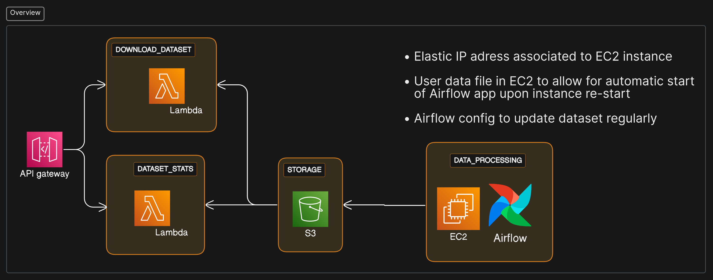
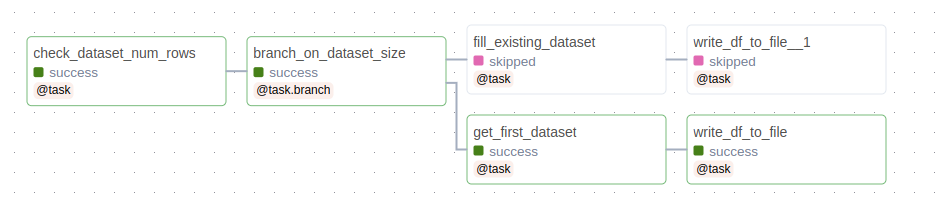

# Crypto Data ETL pipeline with Airflow and AWS 

:us:

This project aims to **collect and update data on Crypto Tokens like like Bitcoin and Ethereum** (in the future also Solana) in the form of CSV files covering large periods of trading data collected from the [Binance US API](https://docs.binance.us/#introduction).

Data collected includes: 

* **Token price**

* **Tokens Bought and sold**

* **Num. of aggregate transactions** (transactions of the same token and same price are aggregated together)

* **Net flow for the asset in a certain period**

All that in slices of 5 minutes of data each.


## Acessing the data 

* Dataset statistics (preview of the CSV and info like how many rows are there in file and how many hours are covered) can be acessed  [here](https://jr6cd1g42j.execute-api.us-east-2.amazonaws.com/stage1/dashboard)

* Bitcoin dataset can be downloaded  [here](https://czmejpeff7.execute-api.us-east-2.amazonaws.com/geturl?token=btc)

* Ethereum dataset can be downloaded  [here](https://czmejpeff7.execute-api.us-east-2.amazonaws.com/geturl?token=eth)

All data and metadata is stored on **AWS S3** and links lead to a temporary URL where you can download certain files


## Architecture of the project




There are 3 main scripts running on this application:

**Binance API functions (../crypto_data/dags/include/binance_api.py)**

These are functions that get **data from the binance API**, like Crypto Token price, amount of transactions and returns the data.

**CryptoDataETL class (../crypto_data/dags/include/crypto_data_etl.py)**

This class uses the above functions to **coordinate the extraction of Pandas Dataframes out of the API data**, with parameters such as Max hours of data that the dataset can have, how many mins should be covered by each rows among others. This function provides 2 main public interfaces, **one function for creating a dataset** from scratch and one for **updating an existing dataset** with more and/or newer data.

**Airflow DAG for orchestrating the ETL pipeline (../crypto_data/dags/crypto_data.py)**

This dag implements the pipeline logic, including **branching logic** on the need to either create a dataset or update and existing one and handles cloud connections, such as **reading and uploading to an S3 bucket**.
Not only the CSV files are handled, but the JSON dataset metadata file, with info on the characteristics of the data, are also updated.

**Airflow DAG architecture**




## Setting up the project

**To run the project locally on Linux:**

## 1) create empty folder

## 2) copy file "local_setup.bash" from repo folder project_setup/ to created folder

## 3)change file variables $USER and $HOME_ to current terminal user and path to created folder

## 4) run bash files:
```bash
bash local_setup.bash
```

## 5) Follow instructions on file to add AWS connections to Airflow with AWS acess ID and secret acess keys 
This is to be done manually due to security reasons related to the AWS account and services

## 6) To acess Airflow UI just connect to Localhost 8080


**To run the project on EC2 instances:**

## 1) create an EC2 instance, choose model with at least 2gb of RAM

## 1.1) Either during creating of after, open a custom TCP connection with all traffic allowed on port 8080 (for connecting to airflow UI)

## 1.2) Edit the "user-data" config on the EC2 instance and copy and paste the "vm_setup.bash" file from the project_setup/ foler on the "user-data" space.

## 2) Launch instance

## 3) Wait for a bit and see if installation and start of the airflow project was sucessful

# 4) Follow instructions on file to add AWS connections to Airflow with AWS acess ID and secret acess keys 
This is to be done manually due to security reasons related to the AWS account and services

## 5) To acess Airflow UI just connect to the DNS URL of the Instance on port 8080 (something like {url}:8080 )


