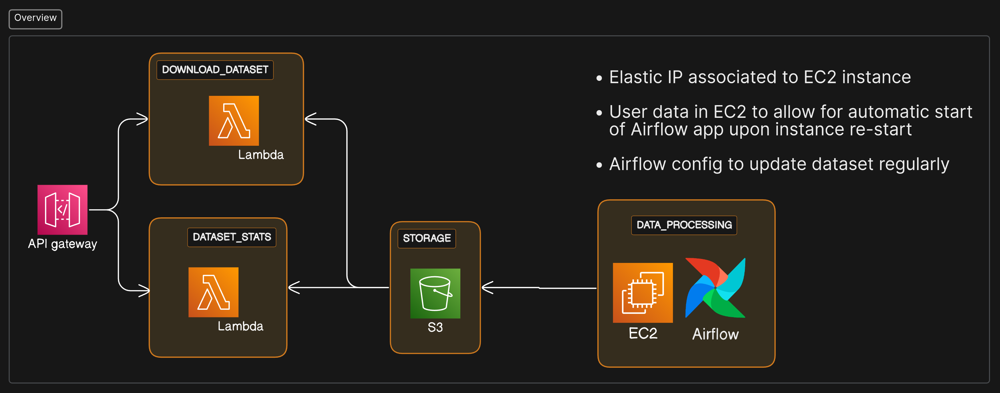

## Crypto Data ETL project with Airflow and AWS 

:us:

This project aims to **collect and update data on Crypto Tokens like like Bitcoin, Ethereum** and in the future Solana in the form of CSV files covering large periods of trading data.

Data collected includes: 

* Token price,

* Tokens Bought and sold

* Num. of aggregate transactions (transactions of the same token and same price are aggregated together)

* Net flow for the asset in a period

All that in slices of 5 minutes of data each.

Data is collected from the [Binance US API](https://docs.binance.us/#introduction)

# Acessing the data 

* Dataset statistics (preview of the CSV and info like how many rows are there in file and how many hours are covered) can be acessed [here](https://jr6cd1g42j.execute-api.us-east-2.amazonaws.com/stage1/dashboard)

* Bitcoin dataset can be downloaded [here](https://czmejpeff7.execute-api.us-east-2.amazonaws.com/geturl?token=btc)

* Ethereum dataset can be downloaded [here](https://czmejpeff7.execute-api.us-east-2.amazonaws.com/geturl?token=eth)

All data and metadata is stored on **AWS S3** and links lead to a temporary URL where you can download certain files

# Architecture of the application 

There are 3 main scripts running on this application:

* Binance API functions (../crypto_data/dags/include/binance_api.py)

These are functions that get **data from the binance API**, like Crypto Token price, amount of transactions and returns the data.

* CryptoDataETL class (../crypto_data/dags/include/crypto_data_etl.py)

This class uses the above functions to **coordinate the extraction of pandas dataframes out of the API data**, with parameters such as Max hours of data that the dataset can have, how many mins should be covered by each rows among others. This function provides 2 main public interfaces, **one function for creating a dataset** from scratch and one for **updating an existing dataset** with more and/or newer data.

* Airflow DAG for orchestrating the ETL pipeline (../crypto_data/dags/crypto_data.py)

This dag implements the pipeline logic, including **branching logic** on the need to either create a dataset or update and existing one and handles cloud connections, such as **reading and uploading to an S3 bucket**.
Not only the CSV files are handled, but the JSON dataset metadata file, with info on the characteristics of the data, are also updated.

**Airflow DAG architecture**

